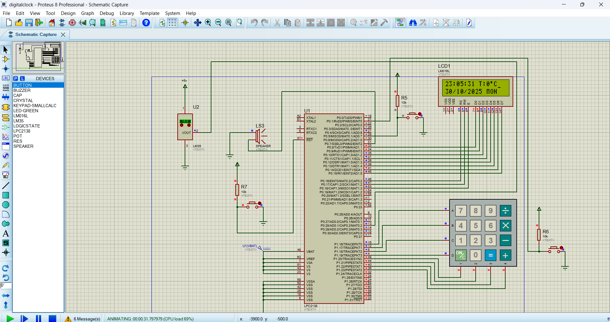
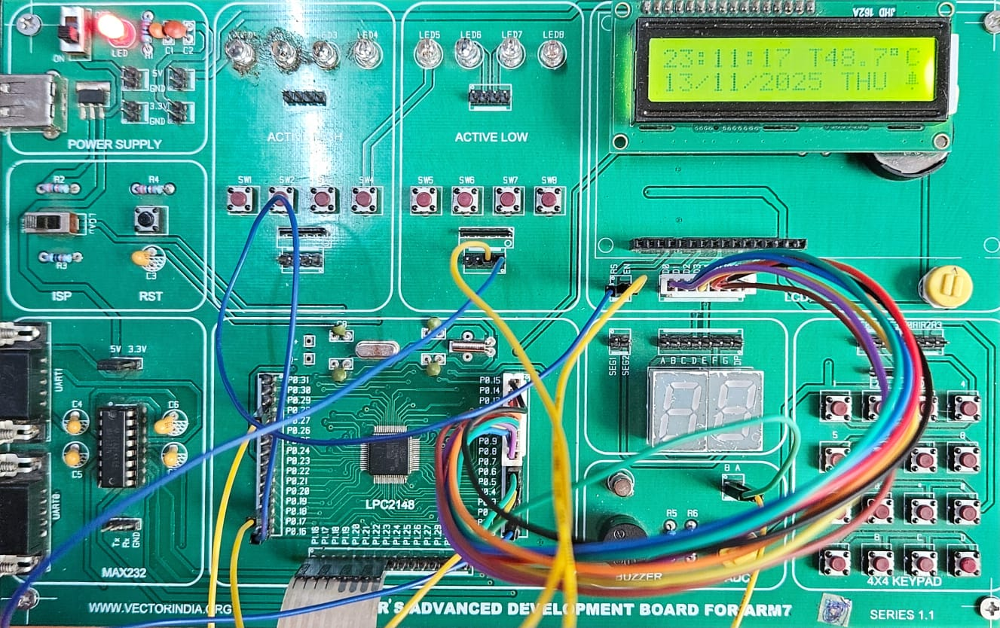

# ENVIROCLOCK ⏰🌡️

**ENVIROCLOCK** is a multifunction **alarm clock with room temperature display** developed on **LPC2148 (ARM7)**. It is a real-time embedded system that displays **time, day, and ambient temperature**, and supports **up to four user‑set alarms**. The system uses **RTC for timekeeping**, **ADC for temperature sensing**, **keypad-based user input**, **LCD output**, and **buzzer alerts**, with **interrupt‑driven handling** for responsive operation. The project demonstrates **modular firmware design** and efficient **real‑time embedded system integration** using **Keil uVision** and **Proteus simulation**.

---

## 🔧 Features

* Real‑Time Clock (RTC)
* Room temperature monitoring (ADC based)
* LCD display (time, date, day, temperature)
* Alarm functionality
* Embedded C firmware
* Proteus / hardware‑ready design

---

## 🧠 Hardware Used

* **Microcontroller:** LPC2148 (ARM7)
* **Display:** 16×2 LCD
* **Temperature Sensor:** LM35 (or equivalent)
* **Clock Source:** Internal RTC
* **Power Supply:** 5V

---

## 💻 Software & Tools

* **Keil uVision** (ARM Compiler)
* **Embedded C**
* **Proteus** (for simulation)
* **Git & GitHub** (version control)

---

## 📂 Project Structure

```
ENVIROCLOCK/
├── src/                 # Source code files
├── circuit_images/      # Circuit & project images
│   ├── enviroclk.png
│   └── lpc2148 enviroclk.jpeg
├── README.md
```

---

## 🖼️ Circuit Diagram

### LPC2148 EnviroClock Circuit



### LPC2148 Hardware Connections



---

## ⚙️ How to Build & Run

1. Open **Keil uVision**
2. Load the project (`.uvproj`)
3. Build the project
4. Flash the code to LPC2148
5. Power ON the board
6. Observe time & temperature on LCD

---

## 🚀 Applications

* Embedded systems learning project
* ARM firmware development practice
* Academic mini / major project
* Digital clock & environment monitoring

---

## 👤 Author

**Hudaykiran**
Embedded Systems & ARM Firmware Developer

* GitHub: [https://github.com/Huday-Embedded-Eng](https://github.com/Huday-Embedded-Eng)

---

## 📜 License

This project is open‑source and free to use for educational purposes.

---

⭐ *If you like this project, give it a star on GitHub!*
